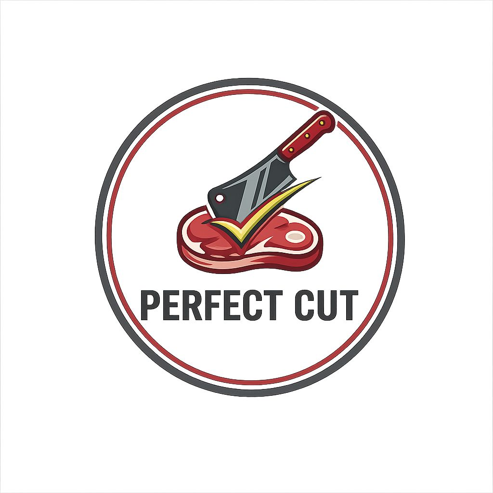
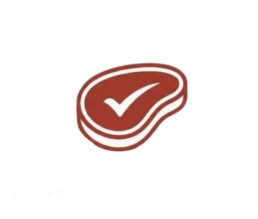
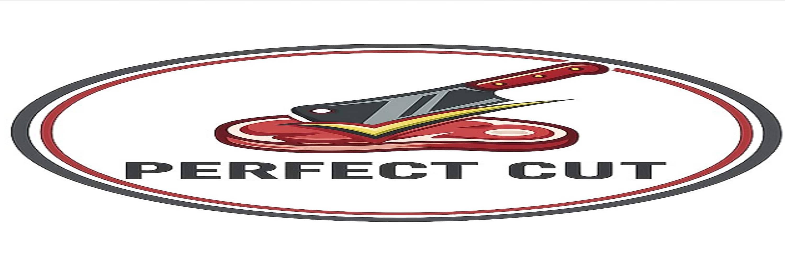

# 🎨 Documento de Identidade Visual — Perfect Cut

Este documento estabelece as diretrizes visuais, cromáticas e tipográficas para a marca e a plataforma web **Perfect Cut**. O objetivo deste documento é garantir a consistência estética e a integridade da marca em todas as suas aplicações na interface do usuário (UI).

---

## 1. Conceito e Essência da Marca
O **Perfect Cut** é uma plataforma que une a tradição do comércio de carnes à modernidade da tecnologia. A identidade visual foi projetada para transmitir os seguintes valores:
*   **Confiabilidade & Qualidade:** Garantia de uma boa escolha de corte.
*   **Sofisticação Prática:** Facilitar o gourmet/churrasco do dia a dia sem complicações.
*   **Apetite (Sensorial):** Cores e elementos que remetem à gastronomia e ao churrasco.

---

## 2. O Logotipo e Suas Variações
A marca conta com elementos gráficos que representam o universo dos cortes de carne (como as opções de silhueta de bife e cutelo). 

### 2.1. Versão Principal (Oficial)
*   **Aplicação:** Utilizada no cabeçalho principal da plataforma web (Navbar) e em materiais de alta visibilidade.
*   **Arquivo de referência:**
*   

### 2.2. Versão Simplificada / Ícone (Favicon)
*   **Aplicação:** Ideal para avatares de redes sociais, botões pequenos e como *Favicon* (ícone da aba do navegador web).
*   **Arquivo de referência:**
*   

### 2.3. Área de Respiro e Redução Mínima
*   **Área de não-interferência:** Deve-se manter um espaço livre ao redor do logotipo equivalente à altura da letra principal do texto, evitando que elementos da interface fiquem colados à logo.
*   **Redução mínima na Web:** O logotipo não deve ser aplicado com tamanho inferior a `120px` de largura na tela para manter a legibilidade do texto.

---

## 3. Paleta de Cores (Cromia)
As cores foram selecionadas estrategicamente para ativar o aspecto sensorial e garantir um excelente contraste de acessibilidade na web.

### 3.1. Cores Primárias
*   **Vermelho Carne / Bordeaux:** '[#8C0303]'
    *   *Significado:* Estimula o apetite, remete à carne fresca e ao calor do preparo/fogo.
*   **Preto Carvão / Grafite Escuro:** `[#685E5E]`
    *   *Significado:* Traz sofisticação, modernidade e serve como a cor principal para textos  da interface.

### 3.2. Cores Secundárias e de Suporte
*   **Branco Off-White:** `[#F0E4DD]`
    *   *Significado:* Utilizado para o fundo geral do site (Background), garantindo uma leitura limpa e confortável.
*   **Dourado / Tom de Grelha:** `[#C8AB66]`
    *   *Significado:* Remete a prosperidade e riqueza o que da um toque mais sofisticado utilizado-o no logo principal.

---

## 4. Tipografia (Família Tipográfica)
A escolha das fontes visa equilibrar o peso visual dos títulos com a legibilidade das informações dos cortes de carne no site.

### 4.2. Tipografia para Corpo de Texto (Body / Interface)
*   **Fonte sugerida:** `['Montserrat',system-ui,sans-serif;]`
*   **Estilo:** Regular e Medium.
*   **Aplicação:** Descrição dos cortes de carne, preços, textos institucionais e menus de navegação.

---

## 5. Diretrizes de Aplicação na Interface Web (CSS)
Para garantir que o código HTML/CSS respeite estritamente este documento, as seguintes variáveis devem ser declaradas no arquivo de estilos (`style.css`):

'''css
:root {
  /* Cores */
  --primary-color: #8C0303;     /* Vermelho Carne */
  --secondary-color: #685E5E;   /* Preto Carvão */
  --bg-color: ##F0E4DD;          /* Fundo Off-White */
  --accent-color: #C8AB66;      /* Dourado Destaque logo */
  
  /* Fontes */
  --font-body: 'Montserrat',system-ui,sans-serif;
}

### 6. Usos Incorretos (O que NÃO fazer)
Para evitar a descaracterização do Perfect Cut, é expressamente proibido:

Distorcer as proporções do logotipo.
(esticar horizontalmente ou verticalmente deformando o layout da logo).

Aplicar o logotipo em fundos com baixo contraste 
(ex: logo vermelha sobre fundo marrom essa  escuro tira o destaque da logo).

Utilizar cores que não pertencem à paleta oficial.
(como azuis ou verdes fluorescentes pois descaracteriza a identidade visual da aplicação).

### 7 - Créditos 
Organização do documento de identidade visual- Gustavo Pasti dos Santos.
